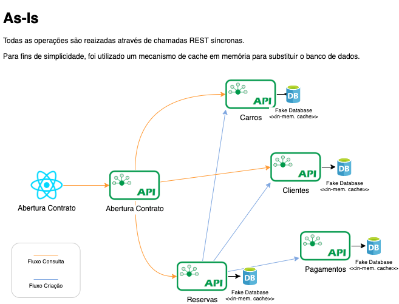

# desafio-kafka-eventdriven
Artefatos para rodar o dojo de aplicar conceitos de event-driven em um app rest síncrono

Na pasta "inicial", está o código fonte de uma aplicação hipotética que controla:
- Estoque de carros disponíveis em uma agência
- Clientes
- Reservas
- Pagamento
- Abertura de Contrato

Esta aplicação é toda baseada em chamadas REST síncronas.
O Desafio será converter tudo para um modelo baseado em eventos assíncronos, utilizando o Kafka como intermediário. 
A ideia é que seja implementado o padrão SAGA para manter a jornada íntegra, ou seja, um contrato somente poderá ser aberto na confirmação da reserva, e a reserva só é liberada para utilização no contrato caso o pagamento seja confirmado. Qualquer evento de erro ou não conclusão deverá invalidar o evento anterior.

